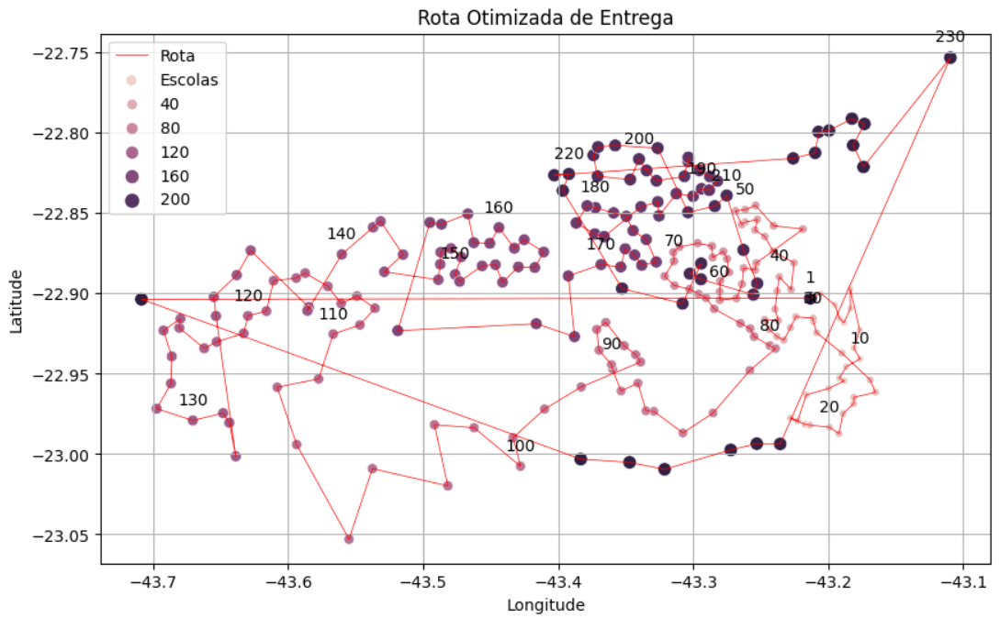

# Projeto de Técnicas de Programação I

Você trabalha em uma consultoria de dados que foi contratada para realizar a distribuição de materiais didáticos nas escolas da cidade do Rio de Janeiro. Sua missão é realizar tratamentos nos dados de acordo com as normas de padrão definidas pelo cliente e encontrar qual a melhor rota que um caminhão deve realizar para entregar os materiais didáticos de forma a otimizar o seu percurso. 

Para esse projeto você recebeu três arquivos:
- escolas.csv: contém os dados das escolas
- subprefeituras.csv: contém dados de quais bairros pertem a cada subprefeitura
- material_didatico.csv: contém a quantidade de material didático que cada escola deve receber

Como produto final, você deve entregar:
- um arquivo csv contendo os dados no padrão especificado com as escolas ordenadas em que os materiais didáticos devem ser entregues e com as colunas contendo id da escola, nome da escola, tipo da escola (EM, CIEP ou colégio), logradouro da entrega, número, bairro, subprefeitura, latitude, longitude e quantidade de material didático que deve ser entregue;
- um arquivo csv com a quantidade total de material escolar por subprefeitura para que sejam contabilizados os custos por subprefeitura

Como padrão dos dados, considere:
- nome das colunas em snake_case
- strings não devem conter acentos
- todas as strings devem estar em maiúsculo
- padronização do nome dos logradouros sem abreviação (Ex: R. deve estar como Rua)
- latitude e longitude devem conter apenas 5 casas decimais
- os ids da escola devem todos ser strings com 3 caracteres (Ex: '024')

Desafio:

Entregar um plot com a representação da melhor rota que você encontrou, por exemplo:

